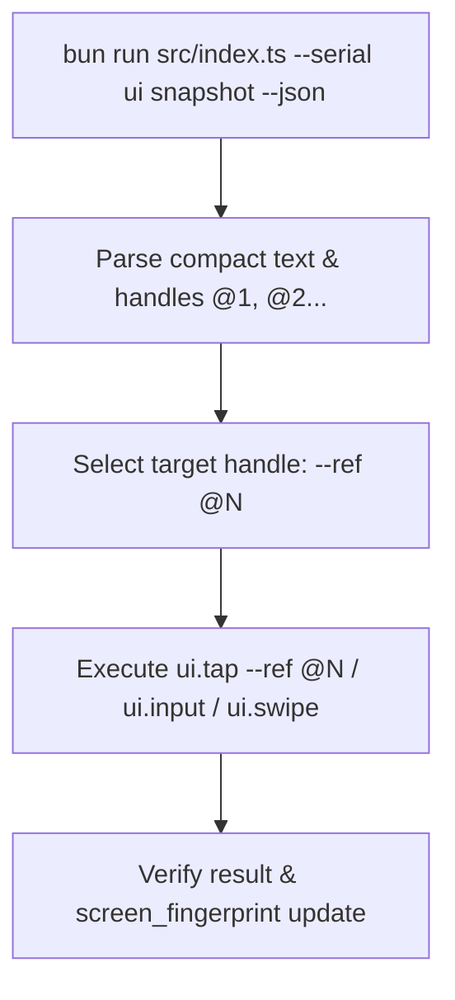

# u2bun — Agent Skill & Operational Contract

---

## 0. Routines Protocol (Run FIRST on every task)

Routines are concise, deterministic step-by-step scripts derived from real executions. They eliminate trial-and-error on repeated objectives.

### 0.1 Lookup Flow

```
TASK RECEIVED
    │
    ▼
Does .agents/skills/u2bun/routines/ exist?
    ├── NO  → mkdir .agents/skills/u2bun/routines/
    │
    ▼
Does routines/<slug>.md exist for this objective?  (see §0.3 for slug rules)
    ├── YES → READ IT. Execute its steps literally. Skip exploration.
    └── NO  → Proceed with normal §1–§4 interaction loop.
              On task completion → CREATE routines/<slug>.md (§0.2).
```

### 0.2 Routine File Format

After completing (or on meaningful partial completion of) an objective, write the routine file:

```markdown
# <Human-readable objective title>

## Context
- App package / Activity where this starts: `<package>`
- Precondition: <what must be true on screen before step 1>

## Steps
inside u2bun

1. `bun run src/index.ts --serial <SERIAL> ui tap --text "<X>" --json`
2. `bun run src/index.ts --serial <SERIAL> ui dump --json`  → verify screen changed
...

## Postcondition
<What the final screen looks like — fingerprint hint or visible text>

## Known Pitfalls
- <Any selector ambiguity, timing issue, or OS dialog that appeared>
```

### 0.3 Slug Rules

| Rule | Example objective | Slug |
|---|---|---|
| Lowercase words joined by `-` | "Like a post on Facebook" | `like-post-facebook.md` |
| Strip articles/prepositions | "Tap the back button" | `tap-back-button.md` |
| Max 5 words | "Open notification shade and clear all" | `open-notification-clear-all.md` |

---

`u2bun` is a zero-dependency, ultra-fast TypeScript/Bun rewrite of `u2ctl`. Output to `stdout` is **JSON by default when `--json` is set**. Diagnostics and audit logs go to `stderr`.

---

## 1. Quickstart & Capability Discovery

```bash
# 1. Discover capability catalog and OpenAI function schemas
bun run src/index.ts tools schema --format openai --json

# 2. List connected ADB devices (serial auto-selected if only 1 device connected)
bun run src/index.ts device list --json

# 3. Get device metadata and screen status
bun run src/index.ts --serial da0f5e72 device info --json

# 4. Dump ultra-compact semantic UI snapshot with handles @1, @2, ... (85%+ token savings)
bun run src/index.ts --serial da0f5e72 ui snapshot --json

# 5. Tap element directly by ref handle (@1, @2, ...)
bun run src/index.ts --serial da0f5e72 ui tap --ref @1 --json

# 6. Input text into focused field
bun run src/index.ts --serial da0f5e72 ui input --text "Hello Bun" --json
```

---

## 2. Standard Interaction Loop (v2 — Handle-First)



### Key Rules & Optimizations
1. **Handle-First Selection**: Prefer `ui snapshot` and `--ref @N` over raw `ui dump`. It reduces LLM context window tokens by 85%+ and uses the background daemon for sub-20ms action execution.
2. **Auto-Serial Selection**: `--serial <SERIAL>` is optional when exactly 1 device is connected.
3. **Semantic Selectors**: Use `--text`, `--resource-id`, or `--description` as fallbacks when `@ref` handles are not available.
4. **Screen Fingerprints**: `ui.snapshot` includes a `screen_fingerprint` hash to detect UI state changes between steps.
5. **Filtered Dump**: System chrome (status bar, navigation bar, IME) is filtered automatically by default. Use `--include-system-bars` if system interaction is required.

---

## 3. Error Codes & Recovery Strategy

All failures return exit code `> 0` and an error envelope:

```json
{
  "schema_version": "1",
  "ok": false,
  "command": "ui.tap",
  "device": "da0f5e72",
  "error": {
    "code": "DEVICE_OFFLINE",
    "message": "Device 'da0f5e72' is offline",
    "retryable": true,
    "hint": "Run u2bun device reconnect --serial da0f5e72"
  }
}
```

| Exit | Error Code | Retryable? | Action Strategy |
|---:|---|:---:|---|
| 1 | `USAGE` | No | Check argument schema with `bun run src/index.ts tools show --name <TOOL> --json`. |
| 2 | `DEVICE_OFFLINE` / `DEVICE_NOT_FOUND` | Yes | Run `bun run src/index.ts device reconnect --serial <SERIAL> --json`. Retry action once. |
| 2 | `DEVICE_UNAUTHORIZED` | Yes | Prompt human operator to accept RSA key prompt on device screen. |
| 3 | `SELECTOR_NOT_FOUND` | No | Re-dump hierarchy with `bun run src/index.ts ui dump --json`. Screen moved. |
| 4 | `PROVISION_BLOCKED` | No | Prompt human operator to enable "Install via USB" in Developer options. |
| 5 | `TIMEOUT` / `TRANSIENT` | Yes | Reconnect device or raise `--timeout <SECS>`. Retry once. |
| 5 | `POSTCONDITION_FAILED` | No | UI did not transition as expected. Re-dump hierarchy to inspect state change. |

---

## 4. Feedback & Error Reporting Contract

### 4.1 Error Report Schema (`u2bun-error-report`)

When a command fails unexpectedly (`code: INTERNAL` exit 10):

```json
{
  "report_type": "u2bun_error_report",
  "timestamp": "<ISO-8601>",
  "command": "<command name, e.g. ui.tap>",
  "serial": "<device serial>",
  "exit_code": 10,
  "error_code": "<ERROR_CODE>",
  "raw_stderr": "<stderr output>",
  "reproduction_steps": [
    "bun run src/index.ts device status --serial da0f5e72 --json",
    "bun run src/index.ts ui tap --text 'Settings' --json"
  ],
  "device_context": {
    "model": "<device model>",
    "android_sdk": 29,
    "screen_fingerprint": "<fingerprint string>"
  },
  "impact": "blocking | degraded | cosmetic"
}
```
