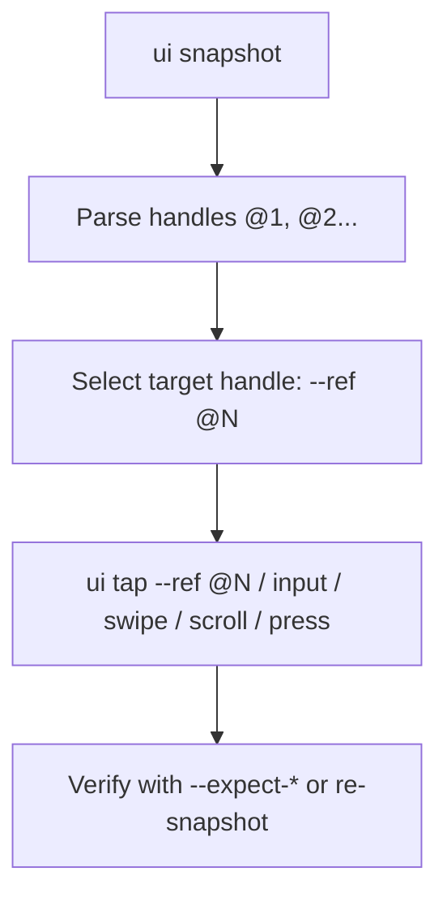

# u2bun — Agent Skill & Operational Contract

---

## 0. Routines Protocol (Run FIRST on every task)

Routines are concise, deterministic step-by-step scripts derived from real executions. They eliminate trial-and-error on repeated objectives.

### 0.1 Lookup Flow

```
TASK RECEIVED
    │
    ▼
Does .agents/skills/u2bun/routines/ exist?
    ├── NO  → mkdir .agents/skills/u2bun/routines/
    │
    ▼
Does routines/<slug>.md exist for this objective?  (see §0.3 for slug rules)
    ├── YES → READ IT. Execute its steps literally. Skip exploration.
    └── NO  → Proceed with normal §1–§4 interaction loop.
              On task completion → CREATE routines/<slug>.md (§0.2).
```

### 0.2 Routine File Format

After completing (or on meaningful partial completion of) an objective, write the routine file:

```markdown
# <Human-readable objective title>

## Context
- App package / Activity where this starts: `<package>`
- Precondition: <what must be true on screen before step 1>

## Steps
inside u2bun

1. `bun run src/index.ts --serial <SERIAL> ui tap --text "<X>" --json`
2. `bun run src/index.ts --serial <SERIAL> ui dump --json`  → verify screen changed
...

## Postcondition
<What the final screen looks like — fingerprint hint or visible text>

## Known Pitfalls
- <Any selector ambiguity, timing issue, or OS dialog that appeared>
```

### 0.3 Slug Rules

| Rule | Example objective | Slug |
|---|---|---|
| Lowercase words joined by `-` | "Like a post on Facebook" | `like-post-facebook.md` |
| Strip articles/prepositions | "Tap the back button" | `tap-back-button.md` |
| Max 5 words | "Open notification shade and clear all" | `open-notification-clear-all.md` |

---

`u2bun` is a zero-dependency, ultra-fast TypeScript/Bun rewrite of `u2ctl`. Output to `stdout` is **JSON by default when `--json` is set**. Diagnostics and audit logs go to `stderr`.

---

## 1. Command Reference (full catalog)

Run everything as `bun run src/index.ts [--serial <SERIAL>] <domain> <command> [flags]`. `--serial` is optional when exactly one device is online. Flags accept kebab-case or snake_case.

### 1.1 `ui` — hierarchy, selectors, gestures

| Command | Purpose | Key flags |
|---|---|---|
| `ui snapshot` | Compact semantic tree with `@1..@N` handles (LLM-first). **Prefer over `ui dump`.** | `--limit` (default 30), `--include-system-bars`, `--include-handles`, `--diff` (only changed lines), `--fingerprint` |
| `ui dump` | Raw actionable element list + fingerprint. Use only when a handle is missing. | `--filter actionable\|all`, `--limit`, `--raw` (returns `raw_xml`) |
| `ui tap` | Tap element by handle or selector. | `--ref @N`, `--text`, `--text-contains`, `--resource-id`, `--desc-contains`, `--description`, `--class-name`, `--bounds`, `--expect-desc-contains`, `--expect-text-contains`, `--expect-element-absent` |
| `ui long_press` | Long-press element. | same selectors as `tap` + `--duration` + `--expect-*` |
| `ui input` | Type into focused field. | `--text`, `--clear-first` |
| `ui type` | Macro: focus field (selector) + type in one step. | `--text` + any `tap` selector |
| `ui swipe` | Gesture from point A to B. | `--from-pos X,Y --to-pos X,Y` (or `--from-x/--from-y/--to-x/--to-y`), `--duration` |
| `ui scroll` | High-level scroll in a direction. | `--direction down\|up\|left\|right`, `--duration` |
| `ui press` | Hardware/nav key. | `--key back\|home\|enter\|delete\|volume_up\|...` |
| `ui wait` | Block until selector appears/disappears. | any `tap` selector + `--timeout` (s), `--absent` |
| `ui find` | Scroll repeatedly until selector found. **Use for "hunt" loops instead of manual scroll+snapshot.** | any `tap` selector + `--scroll-direction`, `--max-scrolls` (default 10), `--scroll-duration` |

### 1.2 Selector flags (shared by tap/long_press/type/wait/find)

- `--ref @N` — handle from the last `ui snapshot` (fastest, sub-15ms).
- `--text "X"` / `--text-contains "X"` — exact / substring match on text.
- `--resource-id "pkg:id/x"` / `--description "X"` / `--desc-contains "X"`.
- `--bounds "[x1,y1][x2,y2]"` — absolute coordinates fallback.
- `--expect-desc-contains` / `--expect-text-contains` / `--expect-element-absent` — postcondition verification; the tap re-dumps and reports `expect_satisfied`.

### 1.3 Other domains

| Command | Purpose | Key flags |
|---|---|---|
| `app current` | Foreground package/activity. | — |
| `app start` | Launch app. | `--package`, `--activity`, `--stop-first` |
| `app stop` | Force-stop app. | `--package` |
| `app list` | Installed packages. | `--third-party-only` (default true) |
| `device list` | Connected ADB devices. | `--online` |
| `device auto` | Resolve single online serial. | — |
| `device status` | Target device state/ready. | — |
| `device info` | Model, SDK, display, current package. | — |
| `device reconnect` | Recover connection. | `--hard` (restart adb server) |
| `setup verify` | Read-only readiness check. | — |
| `setup install` | Idempotent provision runtime. | `--keep-awake` |
| `setup diagnose` | Diagnostic facts, no mutation. | — |
| `tools list` | Capability catalog. | — |
| `tools show` | Spec for one tool/domain. | `--name` |
| `tools schema` | Machine-readable schema. | `--format openai\|raw` |
| `run steps` | Batch sequence in one process. | `--steps '<JSON array>'` or `--file <path>` |

`run steps` composes any sequence, e.g. `run steps --steps '[{"tool":"ui.scroll","args":{"direction":"down"}},{"tool":"ui.snapshot","args":{}}]'`.

### 1.4 Accented / non-ASCII text input

`ui input` **automatically** detects non-ASCII text and routes it through the AdbKeyboard IME broadcast (which preserves UTF-8). The response reports `input_method: "adb_keyboard"` (vs `"clipboard"` for plain ASCII).

- The underlying `setClipboard` + `pasteClipboard` RPC path **corrupts non-ASCII chars** (`í` → `��`), so never force plain-ASCII clipboard for accented text.
- The IME is `com.github.uiautomator/.AdbKeyboard` and must be the active input method. It responds to **`ADB_KEYBOARD_INPUT_TEXT`** (extra `text`, base64-encoded) — NOT `ADB_INPUT_TEXT`/`ADB_INPUT_B64` (the old senzhk ADBKeyBoard actions, which are enqueued but never dispatched).
- Manual fallback (field MUST be focused first, else `ADB_KEYBOARD_CLEAR_TEXT` fails with "null object reference"):
  ```
  adb -s <SERIAL> shell am broadcast -a ADB_KEYBOARD_INPUT_TEXT --es text <base64-of-utf8-text>
  adb -s <SERIAL> shell am broadcast -a ADB_KEYBOARD_HIDE
  ```
- Success signal: broadcast returns `result=-1`. Verify no mojibake via raw dump: assert `'\ufffd' not in raw_xml`.

---

## 2. Standard Interaction Loop (Handle-First)



### Key Rules

1. **Handle-First**: prefer `ui snapshot` + `--ref @N` over `ui dump`. 85%+ token savings, sub-20ms via background daemon.
2. **Hunt loops**: use `ui find` (scroll-until-found) instead of repeated `scroll` + `snapshot`.
3. **Verify cheaply**: use `--expect-*` on mutations, or `ui snapshot --diff` to see only changed lines.
4. **Handles are ephemeral**: `@N` refers to the LAST snapshot; re-snapshot after any screen change before tapping by ref.
5. **Gesture commands** (`swipe`, `scroll`, `press`, `input`) need no prior dump.

---

## 3. Error Codes & Recovery Strategy

All failures return exit code `> 0` and an error envelope:

```json
{
  "schema_version": "1",
  "ok": false,
  "command": "ui.tap",
  "device": "da0f5e72",
  "error": {
    "code": "DEVICE_OFFLINE",
    "message": "Device 'da0f5e72' is offline",
    "retryable": true,
    "hint": "Run u2bun device reconnect --serial da0f5e72"
  }
}
```

| Exit | Error Code | Retryable? | Action Strategy |
|---:|---|:---:|---|
| 1 | `USAGE` | No | Check argument schema with `bun run src/index.ts tools show --name <TOOL> --json`. |
| 2 | `DEVICE_OFFLINE` / `DEVICE_NOT_FOUND` / `DEVICE_NONE` / `DEVICE_AMBIGUOUS` | Yes | Run `bun run src/index.ts device reconnect --serial <SERIAL> --json` or pass `--serial`. Retry once. |
| 2 | `DEVICE_UNAUTHORIZED` | Yes | Prompt human operator to accept RSA key prompt on device screen. |
| 3 | `SELECTOR_NOT_FOUND` / `APP_NOT_FOUND` | No | Re-dump with `ui dump` or `ui snapshot`; screen moved. Verify package with `app list`. |
| 4 | `UIAUTOMATOR_DOWN` | Yes | uiautomator2 runtime down; auto-start should fire, else `setup install`. |
| 4 | `PROVISION_BLOCKED` / `PROVISION_FAILED` | No/Yes | Enable "Install via USB" in Developer options, or `setup diagnose`. |
| 5 | `TIMEOUT` / `TRANSIENT` | Yes | Reconnect device or raise `--timeout <SECS>`. Retry once. |
| 5 | `POSTCONDITION_FAILED` | No | UI did not transition as expected. Re-dump to inspect state. |
| 10 | `INTERNAL` | No | Report via `u2bun-error-report` (§4). |

---

## 4. Feedback & Error Reporting Contract

### 4.1 Error Report Schema (`u2bun-error-report`)

When a command fails unexpectedly (`code: INTERNAL` exit 10):

```json
{
  "report_type": "u2bun_error_report",
  "timestamp": "<ISO-8601>",
  "command": "<command name, e.g. ui.tap>",
  "serial": "<device serial>",
  "exit_code": 10,
  "error_code": "<ERROR_CODE>",
  "raw_stderr": "<stderr output>",
  "reproduction_steps": [
    "bun run src/index.ts device status --serial da0f5e72 --json",
    "bun run src/index.ts ui tap --text 'Settings' --json"
  ],
  "device_context": {
    "model": "<device model>",
    "android_sdk": 29,
    "screen_fingerprint": "<fingerprint string>"
  },
  "impact": "blocking | degraded | cosmetic"
}
```
