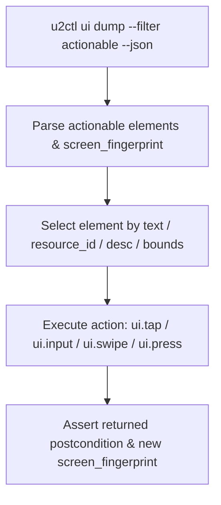

# u2ctl — Agent Skill & Operational Contract

`u2ctl` is a stateless, LLM-agnostic Android control CLI. It exposes a machine-readable capability catalog over standard JSON envelopes.

---

## 1. Quickstart & Capability Discovery

Every agent interaction MUST use the `--json` flag. Output to `stdout` is guaranteed to be a valid JSON envelope. Diagnostics and audit logs go to `stderr`.

```bash
# 1. Discover capability catalog and OpenAI function schemas
u2ctl tools schema --format openai --json

# 2. List connected ADB devices
u2ctl device list --json

# 3. Check target device readiness (read-only)
u2ctl setup verify --serial <SERIAL> --json

# 4. Provision runtime if not ready (idempotent)
u2ctl setup install --serial <SERIAL> --json
```

---

## 2. Standard Interaction Loop



### Key Rules
1. **Always pass `--serial <SERIAL>`** when more than one device is connected.
2. **Prefer semantic selectors**: `text`, `resource_id`, or `description` over raw coordinates.
3. **Use actionable projection**: `ui dump --filter actionable --limit 30` returns pre-filtered interactive elements with bounds and visibility flags.
4. **Disambiguate matches**: If a selector produces `SELECTOR_MATCHED_MULTIPLE` warning, specify `--bounds "X1,Y1-X2,Y2"`.
5. **Verify postconditions**: Check `result.postcondition.satisfied == true` and compare `screen_fingerprint` across screen transitions.

---

## 3. Error Codes & Recovery Strategy

All failures return exit code `> 0` and an error envelope:

```json
{
  "schema_version": "1",
  "ok": false,
  "command": "ui.tap",
  "device": "da0f5e72",
  "error": {
    "code": "DEVICE_OFFLINE",
    "message": "The selected device is offline.",
    "retryable": true,
    "hint": "Run u2ctl device reconnect --serial da0f5e72."
  }
}
```

| Exit | Error Code | Retryable? | Action Strategy |
|---:|---|:---:|---|
| 1 | `USAGE` | No | Check argument schema with `u2ctl tools show --domain <DOMAIN> --json`. |
| 2 | `DEVICE_OFFLINE` / `DEVICE_NOT_FOUND` | Yes | Run `u2ctl device reconnect --serial <SERIAL> --json`. Retry action once. |
| 2 | `DEVICE_UNAUTHORIZED` | Yes | Prompt human operator to accept RSA key prompt on phone. |
| 3 | `SELECTOR_NOT_FOUND` | No | Re-dump hierarchy with `u2ctl ui dump --filter actionable --json`. Screen moved. |
| 4 | `PROVISION_BLOCKED` | No | Prompt human operator to enable "Install via USB" in Developer options. |
| 5 | `TIMEOUT` / `TRANSIENT` | Yes | Reconnect device or increase `--timeout <SECS>`. Retry once. |
| 5 | `POSTCONDITION_FAILED` | No | UI did not transition. Re-dump hierarchy to inspect state change. |

---

## 4. Contract for Reporting Errors & Improvements

When an agent encounters an unresolvable issue, unexpected device behavior, or needs a missing capability, it MUST produce a structured feedback report adhering to this contract.

### 4.1 Error Report Schema (`u2ctl-error-report`)

When a command fails with `code: INTERNAL` (exit 10), unexpected driver error, or OS-level policy lock:

```json
{
  "report_type": "u2ctl_error_report",
  "timestamp": "<ISO-8601>",
  "command": "<command name, e.g. ui.tap>",
  "serial": "<device serial>",
  "exit_code": 10,
  "error_code": "<ERROR_CODE>",
  "raw_stderr": "<stderr output>",
  "reproduction_steps": [
    "u2ctl device status --serial da0f5e72 --json",
    "u2ctl ui tap --text 'Settings' --json"
  ],
  "device_context": {
    "model": "<device model>",
    "android_sdk": 31,
    "screen_fingerprint": "<fingerprint string>"
  },
  "impact": "blocking | degraded | cosmetic"
}
```

### 4.2 Improvement / Feature Proposal Schema (`u2ctl-feature-proposal`)

When an agent experiences friction, missing selectors, or missing capability domain:

```json
{
  "report_type": "u2ctl_feature_proposal",
  "timestamp": "<ISO-8601>",
  "category": "new_capability | selector_enhancement | performance | error_handling",
  "proposed_capability_name": "domain.action (e.g., ui.drag_and_drop)",
  "problem_statement": "Short description of what the agent tried to accomplish and why existing tools were insufficient.",
  "suggested_input_schema": {
    "type": "object",
    "properties": { ... }
  },
  "workaround_used": "How the agent bypassed the limitation (e.g. raw shell, coordinate math, multi-step swipe)."
}
```
